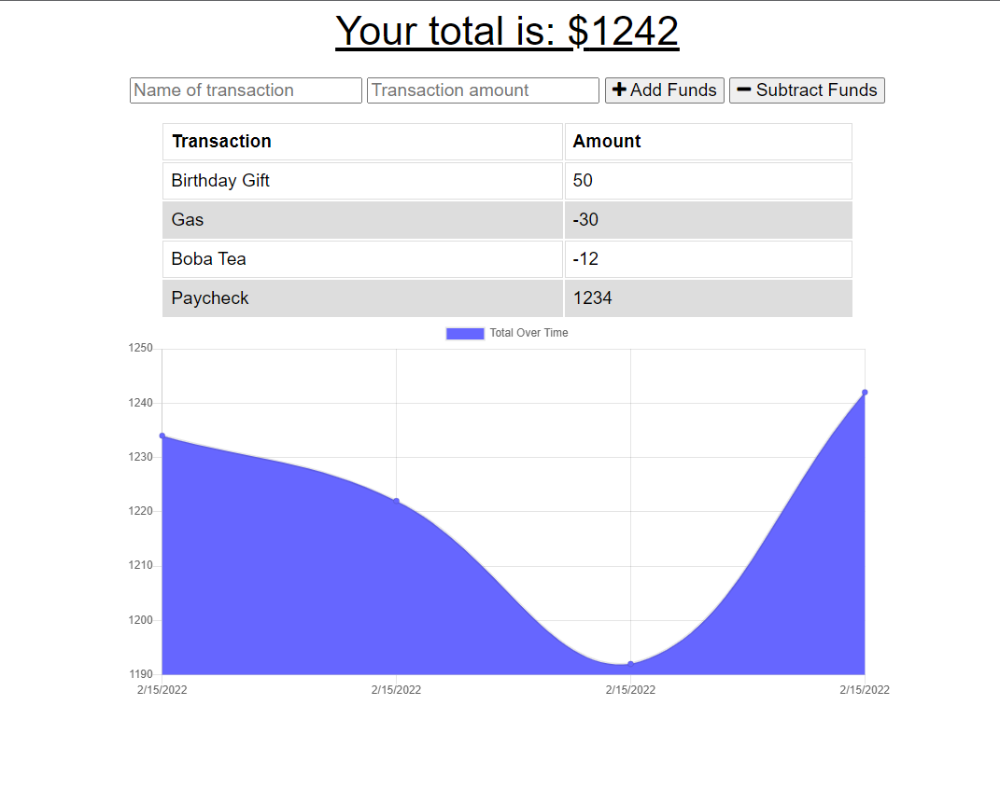

# Budget Tracker

## Description
Offline functionalities in applications are only becoming more popular. They can be especially necessary when it comes to important information such as handling a users finances. This application allows a user to track their money quickly and easily with a visual representation of the users expenses and deposits made in their budget. Not only that, but users can submit data without an internet connection and reliably expect the application to add their entries to the tracker once the application is back online.

### User Story
```
AS AN avid traveler
I WANT to be able to track my withdrawals and deposits with or without a data/internet connection
SO THAT my account balance is accurate when I am traveling 
```

## Challenge Criteria / Expected Behavior
```
GIVEN a budget tracker without an internet connection
WHEN the user inputs an expense or deposit
THEN they will receive a notification that they have added an expense or deposit
WHEN the user reestablishes an internet connection
THEN the deposits or expenses added while they were offline are added to their transaction history and their totals are updated
```

This application began as a regular, pre-built web application from starter code you can see [here](https://github.com/coding-boot-camp/symmetrical-bassoon). I then added a web manifest to this application as well as service workers in order to enhance this web application into becoming a full mobile-first PWA. This applicaiton uses MongoDB and is deployed on Heroku using MongoDB Atlas.



## Usage
View deployment on heroku [here](https://nameless-ridge-96330.herokuapp.com/).

## Questions 
If you have any question on this project, feel free to reach me through my [GitHub profile](https://github.com/adairconlin/) or email me at adairconlin@gmail.com